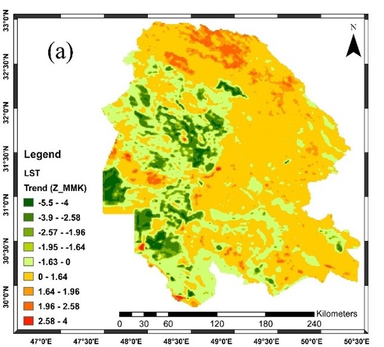
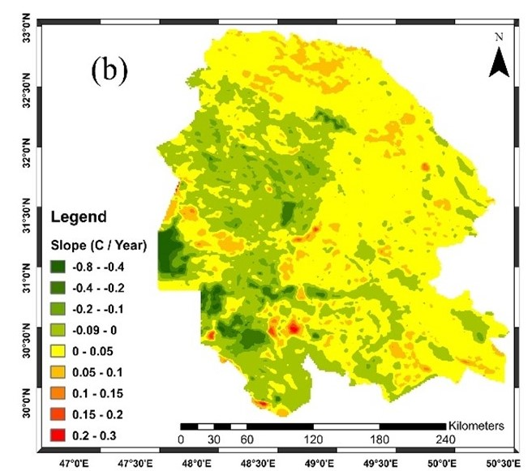

# LST Prediction Framework for Khuzestan Province

This repository contains code for a comprehensive spatiotemporal framework to predict Land Surface Temperature (LST) in Khuzestan Province using satellite data and machine learning techniques, as described in the study titled *"A Spatiotemporal Framework for Land Surface Temperature Prediction Using Machine Learning and Uncertainty Quantification."*

## Overview

The project leverages:
- Google Earth Engine (GEE) for data collection
- Machine learning models (Random Forest, XGBoost, Multiple Linear Regression) for LST prediction
- SHAP analysis for feature importance
- Quantile Regression Forest (QRF) for uncertainty quantification

The study covers data from 2001 to 2023 and includes environmental and anthropogenic variables.
## Key Results

### 1. Model Performance
- **Best Models**:
  - RF/XGBoost: RMSE=1.5°C, R²=0.92
  - MLR (baseline): RMSE=5.5°C, R²=0.76
- **Temporal Robustness**:
  - XGBoost maintained RMSE=1.4-6.6°C , R²= 0.66-0.98 across the province

### 2. Key Predictors (SHAP)
```python
['Min_Temp', 'NDVI', 'ET', 'Soil_Moisture', 'Max_Temp', 'Land_Cover']
```
### 3. Uncertainty Quantification (QRF)
- **Prediction Intervals**:
  - 55% of predictions within ±2°C
  - 35% within ±2°C to ±5°C 
  - 10% within ±5°C to ±8°C
- **Spatial Patterns**:
  - Lower uncertainty (±1-2°C) in:
    - Dense vegetation areas
    - Water bodies
  - Higher uncertainty (±5-8°C) in:
    - Urban heat islands
    - Bare soil regions
### 4. Trend Analysis (Mann-Kendall)

#### Key Findings
- **Dominant Pattern**: 
  - Most regions showed no significant trend (Z-score: -1.63 to 0)
  - Cooling concentrated in agricultural/water zones (Z-score < -1.96)
  
#### Significant Cooling Trends (p < 0.05)
- **Agricultural Areas**
- **Water Bodies**

#### Warming Trends
- **Localized Hotspots**:
  - Urban areas
  - Arid lands

#### Spatial Patterns
<div style="display: flex; justify-content: space-between;">
  
  
</div>
*Figure 2: Left - Mann-Kendall Z-score indicating trend significance and direction; Right - Sen's slope magnitudes*

#### Land Cover Correlation
| Land Cover Type       | Avg Slope (°C/year) | Significance |
|-----------------------|---------------------|--------------|
| Dense Agriculture     | -0.65               | p < 0.01     |
| Water Bodies          | -0.35               | p < 0.05     |
| Urban Areas           | +0.28               | p < 0.1      |
| Bare Soil             | +0.12               | Not Significant |

## Repository Structure

- `Collect_Data_GEE_Py.ipynb`: Jupyter notebook for collecting satellite and meteorological data using Google Earth Engine (e.g., MODIS, ERA5).
- `Main_Model.ipynb`: Core modeling notebook implementing Random Forest (RF), Extreme Gradient Boosting (XGBoost), Multiple Linear Regression (MLR), SHAP analysis, and QRF for uncertainty quantification.
- `Trend_Analysis.ipynb`: Notebook for analyzing temporal trends in LST predictions with Mann-Kendall test.
- `requirements.txt`: List of Python dependencies required to run the code.

## Prerequisites

- **Python**: Version 3.8 or higher.
- **Google Earth Engine Account**: Required for data collection. [Sign up here](https://earthengine.google.com).
- **Dependencies**: Install required libraries using:
  ```bash
  pip install -r requirements.txt
  ## Key Dependencies

The main Python dependencies include:
- `earthengine-api`
- `pandas`
- `numpy`
- `scikit-learn`
- `xgboost`
- `shap`
- `matplotlib` (for visualizations)

## Setup Instructions

### Clone the Repository
```bash
git clone https://github.com/AliRezaee86/LST_ML_.git
cd LST_ML_
```
## Setup Instructions

### Install Dependencies
```bash
pip install -r requirements.txt
```
### Authenticate Google Earth Engine
Run the following command and follow the prompts to authenticate:

```bash
earthengine authenticate
```
### Run Notebooks

1. Start with [`Collect_Data_GEE_Py.ipynb`](Collect_Data_GEE_Py.ipynb) to:
   - Fetch satellite data
   - Preprocess data

2. Proceed to [`Main_Model.ipynb`](Main_Model.ipynb) for:
   - Model training (RF, XGBoost, MLR)
   - Model evaluation
   - SHAP analysis
   - Uncertainty quantification (QRF)

3. Use [`Trend_Analysis.ipynb`](Trend_Analysis.ipynb) to:
   - Analyze temporal trends
   - Generate visualizations
## Workflow

### 1. Data Collection ([`Collect_Data_GEE_Py.ipynb`](Collect_Data_GEE_Py.ipynb))
- **Data Sources**:
  - **Primary Variables**:
    - Land Surface Temperature (LST)
    - Precipitation
    - Max Temperature
    - Min Temperature
    - Soil Moisture
    - Evapotranspiration (ET)
    - Normalized Difference Vegetation Index (NDVI)
  - **Ancillary Data**:
    - Elevation data
    - Land cover classification

- **Preprocessing**:
  - Cloud masking and gap-filling for optical data
  - Temporal aggregation (daily → monthly)
  - Spatial resampling to common resolution (1km)

### 2. Model Training & Evaluation ([`Main_Model.ipynb`](Main_Model.ipynb))
- **Modeling Framework**:
  - Algorithms:
    - Random Forest (RF) - Primary model
    - XGBoost - Comparative model
    - Multiple Linear Regression (MLR) - Baseline
  - Input Variables:
    ```python
    ['LST', 'NDVI', 'Precipitation', 'Soil_Moisture', 
     'Max_Temp','Min_Temp' , 'ET', 'Elevation', 'Land_Cover']
    ```

- **Outputs & Visualizations**:
  - Model performance metrics (RMSE, MAE, R²)
  - Feature importance plots (SHAP values)
  - Prediction maps
  - Residual analysis plots
  - Uncertainty maps (QRF prediction intervals)

### 3. Trend Analysis ([`Trend_Analysis.ipynb`](Trend_Analysis.ipynb))
- **Statistical Analysis**:
  - Mann-Kendall trend test for:
  - Sen's slope estimation
  - Significance testing (p < 0.05)

- **Outputs & Visualizations**:
  - Trend magnitude maps (Sen's slope)
  - Significance maps (p-values)
  - Spatial trend patterns
  - Hotspot/coldspot identification

 ## Notes

- **Internet Connection**: 
  - A stable internet connection is required for accessing Google Earth Engine (GEE) data services
  - Recommended minimum speed: 5 Mbps for optimal performance

- **Model Optimization**:
  - Comprehensive hyperparameter tuning included for:
    - Random Forest (n_estimators, max_depth, etc.)
    - XGBoost (learning_rate, max_depth, etc.)
  - Located in [`Main_Model.ipynb`](Main_Model.ipynb) under "Model Tuning" section

## Framework Adaptability

This framework can be easily adapted for other regions by modifying:

### Key Configuration Parameters
- **Region of Interest**:
  - Replace the shapefile (`shapefile_path`) with your study area boundary
  - Supported formats: `.shp`, `.geojson`, or any geopandas-readable vector format
- **Temporal Parameters**:
  - Adjust `start_year` and `end_year` for different study periods
  - Modify monthly range via `start_month` and `end_month`
- **Data Specifications**:
  - Change `data_source` and `data_band` for different Earth Engine datasets
  - Adjust output resolution (`output_resolution`) as needed

### Example Modifications
```python
# In Collect_Data_GEE_Py.ipynb:

# 1. Change region by specifying new shapefile
CONFIG = {
    'shapefile_path': r"path/to/your/study_area.shp",  # Update this path
    # ... rest of configuration
}

# 2. Modify date range
CONFIG.update({
    'start_year': 2010,  # New start year
    'end_year': 2020,    # New end year
    'start_month': 6,    # June start
    'end_month': 8       # August end (summer months)
})

# 3. Use different dataset (e.g., MODIS LST)
CONFIG.update({
    'data_source': "MODIS/006/MOD11A1",
    'data_band': "LST_Day_1km"
})
```
## Contact

For support or inquiries:
- 🐛 **Report Issues**:  
  [Open a new issue](https://github.com/AliRezaee86/LST_ML_/issues) on GitHub
- 📧 **Email Contact**:  
  [a.rezaee94@gmail.com](mailto:a.rezaee94@gmail.com) 
- 💬 **Discussion Forum**:  
  Consider adding a GitHub Discussions tab to your repository for community questions

## Citation

If you use this framework in your research, please cite:

```bibtex
@article{rezaee2025spatiotemporal,
  title={A Spatiotemporal Framework for Land Surface Temperature Prediction Using Machine Learning and Uncertainty Quantification},
  author={Rezaee, Ali and Collaborators},
  journal={Journal Name},
  volume={XX},
  pages={XXX--XXX},
  year={2025},
  publisher={Publisher}
}
